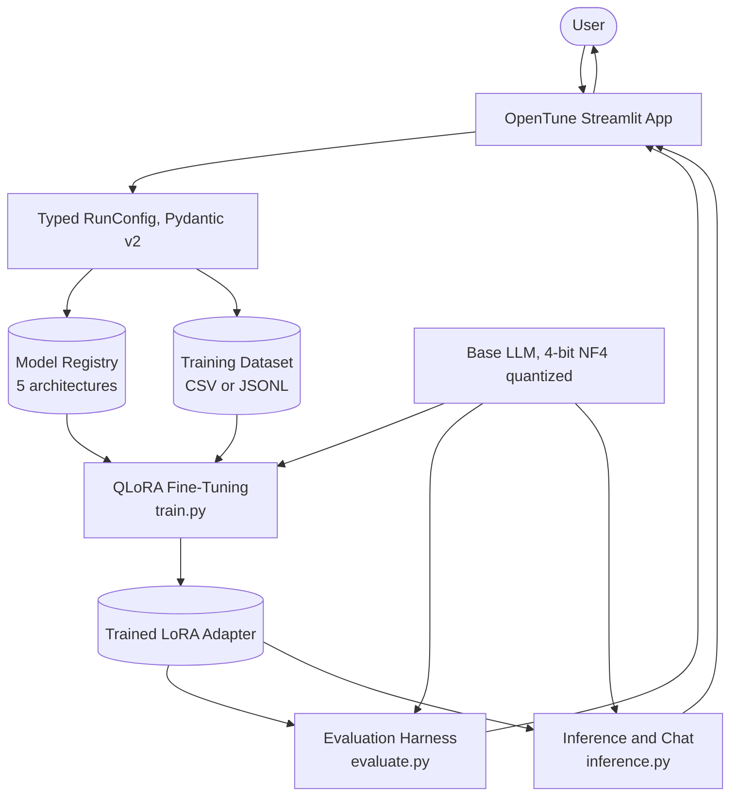
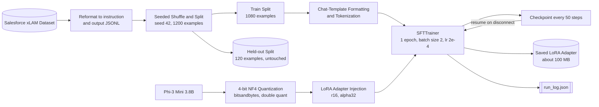
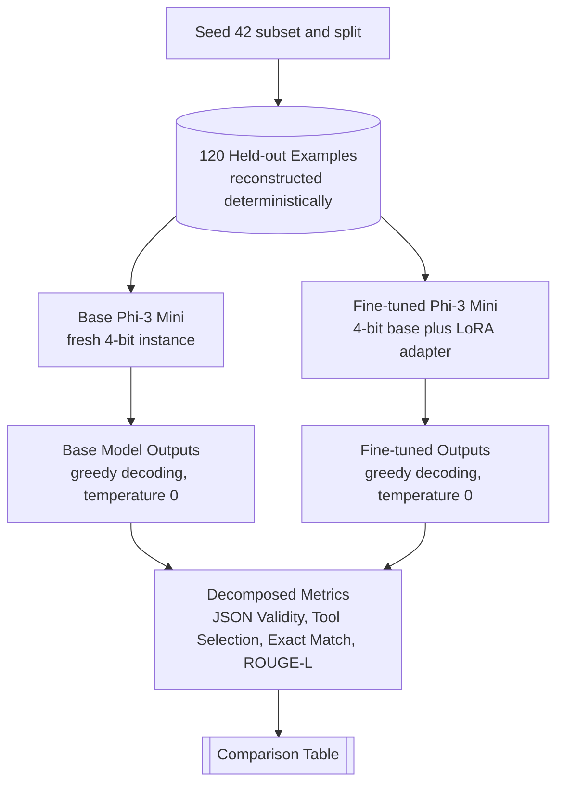
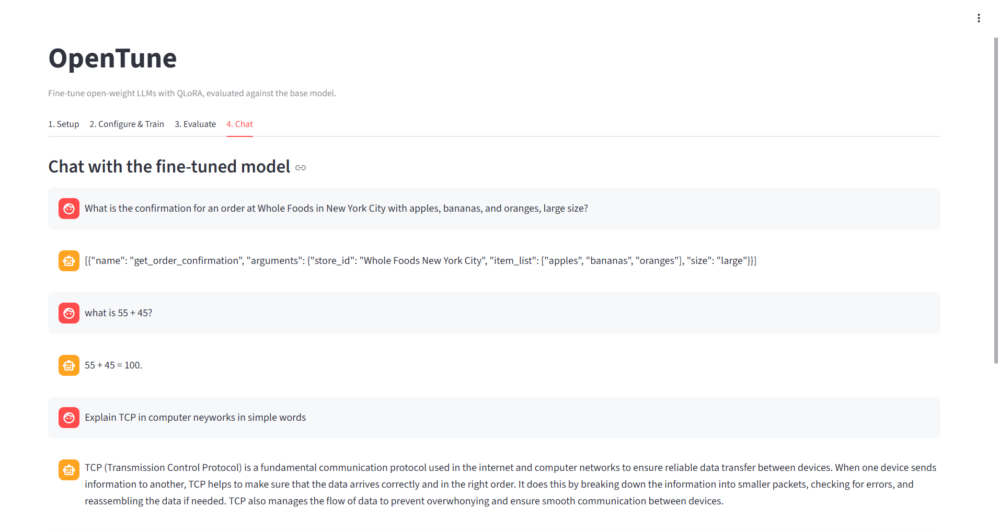
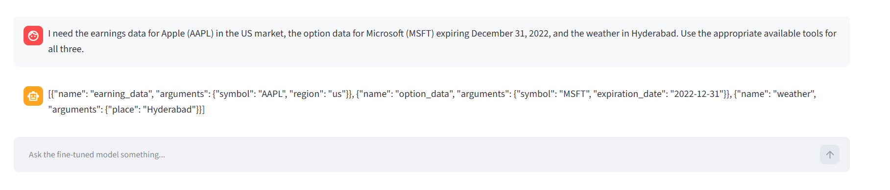

# OpenTune

Fine-tuning a 3.8B open-weight model to do structured function calling as reliably as a purpose-built tool-use model — and proving it with a deterministic, decomposed evaluation harness instead of a single aggregate score.

   

## Contents

- [Overview](#overview)
- [Headline Results](#headline-results)
- [Why OpenTune](#why-opentune)
- [Architecture](#architecture)
- [QLoRA Fine-Tuning](#qlora-fine-tuning)
- [Evaluation Methodology](#evaluation-methodology)
- [Execution Screenshots](#execution-screenshots)
- [Engineering Deep Dive](#engineering-deep-dive)
- [Project Structure](#project-structure)
- [Installation](#installation)
- [Usage](#usage)
- [Configuration Reference](#configuration-reference)
- [Limitations and Future Work](#limitations-and-future-work)
- [License](#license)
- [Author](#author)

## Overview

Function calling is the mechanism that lets an LLM respond to a natural-language request with a structured, machine-executable call — a JSON object naming a tool and its arguments — instead of prose. Small instruction-tuned models are poor at this by default: asked to emit a tool call, they narrate, wrap JSON in commentary or markdown fences, hallucinate tool names that were never offered, or produce output that does not parse at all.

OpenTune fine-tunes Microsoft's Phi-3 Mini (3.8B) with QLoRA on Salesforce's xLAM function-calling data, then evaluates it against the unmodified base model on a fixed held-out split using metrics that actually measure tool-calling correctness rather than surface text similarity. The pipeline — typed run configuration, dataset handling, training, evaluation, inference, and a Streamlit UI — is implemented as testable modules with a unit-test suite covering everything that does not require a GPU.

## Headline Results

Base Phi-3 Mini vs. the QLoRA fine-tuned adapter, on 120 held-out examples with deterministic greedy decoding:

| Metric | Base Model | Fine-Tuned | Change |
|---|---|---|---|
| JSON Validity | 40.8% | 98.3% | **+57.5 pts** |
| Tool Selection Accuracy | 15.8% | 98.3% | **+82.5 pts** |
| Exact Match | 0.0% | 72.5% | **+72.5 pts** |
| ROUGE-L (secondary) | 0.230 | 0.954 | **+0.724** |

The base model produced **zero** exactly-correct tool calls across all 120 examples. The fine-tuned adapter — roughly 100 MB of LoRA weights over a frozen 4-bit base — produces a fully correct call, arguments included, on 72.5% of them, and selects the correct tool(s) on 98.3%.

## Why OpenTune

Reliable function calling is the load-bearing capability behind agentic LLM systems: if the model cannot consistently emit a parseable, correctly-argumented call, nothing downstream of it works. Off-the-shelf small models are not reliable at this, and closing that gap on rented, general-purpose compute (a free-tier Colab GPU, in this case) rather than a purpose-built tool-use model is the problem OpenTune sets out to demonstrate.

Two design decisions separate this from a one-off fine-tuning script:

**A reusable fine-tuning framework, not a single script.** Configuration is a typed Pydantic schema, and base models are resolved through a registry that carries each architecture's own LoRA target-module names. This is not a hypothetical abstraction: Phi-3 fuses its attention and MLP projections into `qkv_proj` and `gate_up_proj` rather than the conventional `q_proj` / `k_proj` / `v_proj` / `gate_proj` / `up_proj` split, so a naive Llama-style target list fails outright on this model. Five architectures are registered (three ungated, two gated), and the registry is what makes swapping the base model a config change rather than a rewrite.

**An evaluation harness built to be trusted, not just to run.** ROUGE-L rewards surface overlap, which is close to noise for function calling — a response can share most of its tokens with the reference while calling the wrong tool. The evaluation was built around metrics that answer the questions that actually matter (does it parse, did it pick the right tool, is the whole call right), and building that harness surfaced real bugs — a prompt-echo bug that was inflating every score, and ordering false negatives — that a single aggregate metric would have hidden entirely. See [Engineering Deep Dive](#engineering-deep-dive).

## Architecture



The Streamlit app (`app.py`) walks through four tabs in order — **Setup** (pick a registered base model, upload a dataset or load an already-trained adapter), **Configure & Train** (LoRA preset and training hyperparameters), **Evaluate** (base vs. fine-tuned comparison), and **Chat** (free-form inference) — and is UI wiring only: every tab calls into the modules below it rather than reimplementing logic. Real training, evaluation, and generation calls need a GPU-backed runtime (a Colab tunnel or a rented GPU box); the config, data-pipeline, and metric layers do not.

The adapter is deliberately **not merged** into the base weights. Inference reconstructs the exact 4-bit quantized base the adapter was trained against and attaches the adapter to it, which keeps training and inference numerics identical — see [Engineering Deep Dive](#engineering-deep-dive) for why that mismatch is a real failure mode, not a theoretical one.

## QLoRA Fine-Tuning

The base model is loaded in 4-bit and frozen; only low-rank adapters on the attention and MLP projections are trained. This fits a full fine-tuning run on a single free-tier Colab GPU.



**Dataset.** [Salesforce/xlam-function-calling-60k](https://huggingface.co/datasets/Salesforce/xlam-function-calling-60k) — 60,000 function-calling examples generated and verified through Salesforce's APIGen pipeline. Each row provides a natural-language `query`, the `tools` available for that query, and the reference `answers` as structured calls. The dataset is gated on Hugging Face; access must be requested once before use.

`colab_real_dataset_training.py` takes a deterministic 1,200-example subset (`raw.shuffle(seed=42).select(range(1200))`) and reformats each row into the shape `data_pipeline.py` expects:

```python
instruction = (
    f"Available tools:\n{tools}\n\n"
    f"User request: {query}"
)
output = answers  # reference function call(s), as JSON
```

`data_pipeline.py` itself is dataset-agnostic — it only knows about generic `instruction` / `output` columns, CSV or JSONL, with configurable column names. That genericness is what lets the Streamlit Setup tab accept an arbitrary user-uploaded dataset through the same code path the xLAM run uses. The 1,200-example subset is then split by a seeded shuffle into **1,080 training examples and 120 held-out evaluation examples**. Because both the subset selection and the split are seeded, the evaluation set is reproducible exactly — a re-evaluation script reconstructs the identical 120 examples from scratch without needing them persisted anywhere.

**Hyperparameters** (the run that produced the [headline results](#headline-results)):

| Parameter | Value |
|---|---|
| LoRA rank (`r`) | 16 |
| LoRA alpha | 32 |
| LoRA dropout | 0.05 |
| Target modules | `qkv_proj`, `o_proj`, `gate_up_proj`, `down_proj` |
| Task type | `CAUSAL_LM` (bias: none) |
| Quantization | 4-bit NF4, double quant, `float16` compute dtype |
| Epochs | 1 |
| Per-device batch size | 2 |
| Learning rate | 2e-4 |
| Max sequence length | 1024 |
| Gradient checkpointing | Enabled |
| Checkpoint interval | Every 50 steps |
| Seed | 42 |

`target_modules` is supplied by the model registry rather than hardcoded in the training config, because it is architecture-specific — this is what makes the Phi-3 fix in `model_registry.py` actually take effect at training time (verified by a dedicated regression test, `test_lora_config_pulls_target_modules_from_registry_not_run_config`). Checkpoints are written to Google Drive rather than Colab's local disk, so a runtime disconnect does not destroy the checkpoints the resume logic depends on.

## Evaluation Methodology



ROUGE-L is reported, but it is explicitly the *secondary* metric. For structured output, the questions that matter are: does it parse, did it pick the right tools, and is the whole call right?

| Metric | What It Measures | Base | Fine-Tuned |
|---|---|---|---|
| JSON Validity | Output contains parseable JSON at all | 40.8% | 98.3% |
| Tool Selection Accuracy | Correct set of tool names called | 15.8% | 98.3% |
| Exact Match | Tool names **and** all arguments correct | 0.0% | 72.5% |
| ROUGE-L (secondary) | Token-overlap F-measure vs. reference | 0.230 | 0.954 |

Implementation details that make these numbers trustworthy:

- Tool-selection and exact-match return `None` — not `False` — when either side fails to parse, keeping "called the wrong tool" distinct from "emitted nothing parseable." `None` still counts against the reported rate, with JSON validity published alongside so the failure mode is decomposable.
- Exact match compares parsed and canonicalized JSON, not raw text, and is order-independent at the top level only — `{"a": 1, "b": 2}` and `{"b": 2, "a": 1}` are the same call, and a list of independent calls in a different order is still the same set of calls, but each individual call's own structure is still compared exactly.
- Both models are decoded greedily at `temperature=0`, so re-running the harness reproduces the table exactly. The interactive Chat tab intentionally keeps sampling (`temperature=0.7`) instead, since variety is desirable there and reproducibility is not.
- `find_tool_correct_but_not_exact()` surfaces the specific examples where the right tool was chosen but an argument was wrong — the dominant residual failure mode at 98.3% tool accuracy against 72.5% exact match.

**Three distinct evaluation paths exist in this repo, at different levels of rigor:**

1. `colab_real_dataset_training.py` ends with a lightweight, non-deterministic ROUGE-only check against 5 raw examples — a sanity check that training produced *something*, not the headline numbers.
2. `colab_reevaluate_existing_adapter.py` is the actual source of the [headline results](#headline-results): it does not retrain, reconstructs the identical 120-example held-out split from the training seed, forces greedy decoding, and prints the full decomposed comparison table.
3. The Streamlit **Evaluate** tab is a third, session-scoped path: it is only available after a fresh training run in the same session (loading an existing adapter skips straight to Chat instead), samples 3 examples from whatever dataset was just uploaded, and currently surfaces only the average ROUGE-L pair in its UI — even though `evaluate_models()` already computes the full JSON-validity / tool-selection / exact-match breakdown underneath. Wiring the richer metrics into that tab is a tracked follow-up (see [Limitations](#limitations-and-future-work)).

## Execution Screenshots

Screenshots of the Chat tab (`app.py`), running the trained adapter against live generation — the same interface the app exposes when tunneled out of a Colab GPU runtime with `colab_app_walkthrough.py`. These are ad hoc, qualitative examples typed directly into the running app, separate from the deterministic 120-example benchmark above.

### Function calling alongside ordinary conversation



A retail order request ("apples, bananas, and oranges, large size, at Whole Foods in New York City") is converted into a single, well-formed `get_order_confirmation` call with all three items and the size captured as arguments. The next two turns — plain arithmetic and a request to explain TCP — are answered directly in natural language with no tool call emitted, showing that fine-tuning for structured output did not come at the cost of the base model's general instruction-following.

### Compound requests spanning multiple tools



A single turn asking for three unrelated things — Apple's earnings data, a Microsoft options quote for a specific expiration date, and the Hyderabad weather — is decomposed into three separate, correctly-argumented calls (`earning_data`, `option_data`, `weather`) returned together as one JSON array, with no arguments conflated across calls.

## Engineering Deep Dive

Every module below the UI is split into two kinds of tests: pure logic (config construction, data transforms, all four correctness metrics, prompt formatting) is exercised by real unit tests with no GPU involved; anything that genuinely needs a GPU (loading real weights, generating text, training) is called through injectable loaders so the *orchestration* — the right calls, in the right order, with the right arguments — is still verified on CPU against fakes. Real end-to-end correctness is verified separately, in Colab, by the six standalone `colab_*.py` scripts. That split is also what caught the bug below that mocks alone could not.

- **A prompt-echo bug silently corrupted every score.** Generation stripped the echoed prompt by decoding the full output and string-matching the prompt off the front. That can never work with a chat template: `apply_chat_template()` writes special tokens (`<|user|>`, `<|end|>`) as literal text, while `decode(skip_special_tokens=True)` strips them back out — so the decoded output could never literally begin with the prompt string. The strip silently no-op'd, and the entire templated prompt was being scored as if it were the model's answer. Fixed by slicing at the token level (`output_ids[0][input_ids.shape[1]:]`) before decoding, which has no such ambiguity.

- **ROUGE-L was the wrong primary metric.** It measures word overlap, which for function calling is close to noise: a response can share most of its tokens with the reference while calling the wrong tool, and a correct call can score poorly for cosmetic formatting differences. The evaluation was rebuilt around JSON validity, tool-selection accuracy, and full exact match, with ROUGE-L demoted to a secondary signal.

- **Exact-match false negatives from ordering.** `{"a": 1, "b": 2}` and `{"b": 2, "a": 1}` are the same call, and an xLAM answer is a *list* of independent calls with no required order — so both key order and call order were producing false mismatches. Fixed with an order-independent comparison: each call is serialized with `sort_keys=True`, and the top-level list is sorted on that canonical form before comparison. Only the top level is order-normalized, so genuine argument errors are still caught.

- **Non-deterministic evaluation runs.** Generation defaulted to `temperature=0.7` with sampling enabled — correct for the interactive chat surface, wrong for measurement, and it meant two evaluation runs on the same adapter could disagree. The harness now forces `temperature=0` (greedy decoding), and the held-out set is reconstructed deterministically from a seeded subset and split rather than being resampled.

- **A quantization mismatch between training and inference.** Training loads the base model in 4-bit NF4 and freezes it; inference originally loaded the base model in full precision before attaching the adapter. This is a genuine train/inference skew, not just slower — the adapter was trained against the module structure bitsandbytes' 4-bit wrapping produces, so attaching it to differently-wrapped modules surfaced as key-path errors and degraded output. Fixed by constructing an identical `BitsAndBytesConfig` at inference time, plus a diagnostic that warns when the installed PEFT version differs from the one recorded in the adapter's own config.

- **Architecture-specific LoRA targets.** The standard `["q_proj", "k_proj", "v_proj", "o_proj"]` target list fails on Phi-3, which fuses those projections into `qkv_proj` and `gate_up_proj`, raising `Target modules {...} not found in the base model`. Target modules are now a per-model registry property, verified against each architecture, with a regression test asserting Phi-3's fused names specifically.

- **Checkpoints that only looked complete.** Resume logic built on a checkpoint directory's *name* alone is unsafe: `Trainer` writes `trainer_state.json` last, after weights, optimizer, and scheduler state, so a disconnect mid-save leaves a `checkpoint-N` directory that passes a name check but is unusable. The resume path now walks backward from the newest checkpoint until it finds one with `trainer_state.json` present, falling through to a clean start rather than crashing on a checkpoint that exists in name only.

- **A type error only a real GPU run could catch.** `SFTTrainer` types `train_dataset` strictly as a real `datasets.Dataset`, not a list of dicts. The orchestration tests using a mocked trainer passed happily, because the fake never validated what it received — the failure only appeared during the first real Colab smoke test. The pipeline now converts to a real `datasets.Dataset` before training, and the fake trainer in `test_train.py` now asserts the type it receives too, so this class of gap cannot go unnoticed again.

- **Colab's preinstalled `torchao` breaks PEFT.** Colab's base image ships an old `torchao` that fails current PEFT's internal capability check the moment `PeftModel.from_pretrained()` runs — even though this project never uses `torchao` at all (bitsandbytes is the only quantization backend OpenTune uses). Every Colab script uninstalls it before importing PEFT rather than working around the check.

## Project Structure

```text
opentune-project/
├── app.py                                # Streamlit UI: Setup / Configure & Train / Evaluate / Chat
├── config.py                             # Pydantic v2 run / LoRA / dataset / training schemas
├── model_registry.py                     # Supported base models + per-architecture LoRA targets
├── data_pipeline.py                      # Load, validate, chat-template format, tokenize, split
├── train.py                              # QLoRA training loop, checkpoint resume, orchestration
├── evaluate.py                           # Function-calling metrics + LLM-as-judge scaffold
├── inference.py                          # Adapter loading and response generation
├── requirements.txt                      # Runtime dependencies
├── colab_smoke_test_train.py             # Minimal GPU smoke test of the training path
├── colab_full_verification.py            # End-to-end train -> evaluate -> infer smoke test
├── colab_real_dataset_training.py        # The real xLAM run (1,200-example subset)
├── colab_reevaluate_existing_adapter.py  # Deterministic re-evaluation, no retraining
├── colab_schema_overlap_check.py         # Train/eval tool-schema overlap analysis (CPU only)
├── colab_app_walkthrough.py              # Serves app.py from Colab via a cloudflared tunnel
├── trained_adapter/
│   ├── adapter_config.json               # r=16, alpha=32, Phi-3 fused target modules
│   └── adapter_model.safetensors         # Trained LoRA weights (~100 MB)
├── assets/
│   └── screenshots/                      # README screenshots (see Execution Screenshots)
└── tests/
    ├── requirements.txt                  # Test-environment dependencies
    ├── fixtures/                         # Shared fixtures for pipeline/training tests
    ├── test_config.py
    ├── test_model_registry.py
    ├── test_data_pipeline.py
    ├── test_train.py
    ├── test_evaluate.py
    ├── test_inference.py
    └── test_app.py
```

## Installation

Requires Python 3.10 and a CUDA GPU for training, evaluation, and GPU inference. The configuration, data-pipeline, and metric layers run on CPU and are covered by the test suite without a GPU.

```bash
git clone https://github.com/<your-username>/OpenTune.git
cd OpenTune
python -m venv opentune-env
source opentune-env/bin/activate    # Windows: opentune-env\Scripts\activate
pip install -r requirements.txt
```

PyPI serves CPU-only `torch` wheels by default. For real training, evaluation, or inference, install a CUDA build first:

```bash
pip install torch --index-url https://download.pytorch.org/whl/cu121
```

To also run the test suite:

```bash
pip install -r tests/requirements.txt pytest
```

The xLAM dataset and two of the five registered base models (Gemma 2 9B, Llama 3 8B) are gated on Hugging Face. Authenticate once and accept the relevant terms on each page before running the real training scripts:

```bash
huggingface-cli login
```

On Google Colab specifically, remove the preinstalled `torchao` before importing PEFT — the bundled version fails current PEFT's internal capability check, even though this project uses bitsandbytes exclusively:

```bash
pip install -r requirements.txt
pip uninstall -y -q torchao
```

## Usage

**Launch the interactive app** (Setup → Configure & Train → Evaluate → Chat):

```bash
streamlit run app.py
```

**Run inference against the adapter committed in this repo:**

```python
from pathlib import Path
from inference import load_finetuned_model, generate_response

loaded = load_finetuned_model(
    base_model_id="phi-3-mini",
    adapter_path=Path("trained_adapter"),
)

prompt = (
    'Available tools:\n'
    '[{"name": "get_weather", "parameters": {"city": {"type": "string"}}}]\n\n'
    'User request: What is the weather in Hyderabad?'
)
print(generate_response(loaded, prompt, temperature=0))
```

**Launch a fine-tuning run from Python:**

```python
from pathlib import Path
from config import RunConfig, DatasetConfig, TrainingConfig
from train import run_training

run_config = RunConfig(
    run_name="xlam-function-calling-001",
    base_model_id="phi-3-mini",
    dataset=DatasetConfig(
        file_path=Path("xlam_function_calling.jsonl"),
        validation_split=0.1,
        max_sequence_length=1024,
    ),
    training=TrainingConfig(
        num_train_epochs=1,
        per_device_train_batch_size=2,
        checkpoint_every_n_steps=50,
    ),
)

result = run_training(
    run_config,
    checkpoints_dir=Path("checkpoints"),
    logs_dir=Path("logs"),
)
print(result.adapter_path, result.final_train_loss)
```

**Reproduce the published benchmark** in a Colab GPU runtime, without retraining:

```bash
python colab_reevaluate_existing_adapter.py
```

It reconstructs the same 120 held-out examples from the training seed, loads the saved adapter, and prints the full metric comparison. To interact with the live app instead of a notebook cell, tunnel it out of Colab:

```bash
python colab_app_walkthrough.py
```

**Run the test suite** — configuration, registry, data pipeline, metrics, orchestration, and UI rendering, none of which need a GPU:

```bash
pytest tests/ -v
```

## Configuration Reference

Every run is described by one `RunConfig` (Pydantic v2), the single object serialized to `logs/<run_name>/run_log.json` alongside its result — so any run can be inspected or reproduced later from that file alone.

| Schema | Governs |
|---|---|
| `DatasetConfig` | File path (validated to exist at config-creation time, not hours into training), column names, validation split, max sequence length |
| `LoRAConfig` | Preset or custom rank/alpha, dropout, target modules, quantization type, gradient checkpointing |
| `TrainingConfig` | Epochs, batch size, learning rate, checkpoint interval, early-stopping patience, seed, CPU/GPU selection |
| `RunConfig` | Run name, registered base model key, and the three schemas above |

Both `DatasetConfig` and `RunConfig` fail fast: an invalid dataset path or an unregistered `base_model_id` raises immediately, with the registered model list included in the error, rather than surfacing hours into a run.

LoRA rank and alpha are set through named presets rather than raw numbers by default:

| Preset | Rank (`r`) | Alpha |
|---|---|---|
| `fast_low_vram` | 8 | 16 |
| `balanced` (default) | 16 | 32 |
| `higher_quality` | 32 | 64 |
| `custom` | user-defined | user-defined |

Choosing any preset other than `custom` overwrites `r` and `lora_alpha` from the table above after validation, regardless of what was passed in for those two fields — pass `preset="custom"` to take direct control of both.

**Registered base models:**

| Key | Repo ID | Parameters | Gated | LoRA Target Modules |
|---|---|---|---|---|
| `phi-3-mini` | `microsoft/Phi-3-mini-4k-instruct` | 3.8B | No | `qkv_proj`, `o_proj`, `gate_up_proj`, `down_proj` |
| `mistral-7b` | `mistralai/Mistral-7B-Instruct-v0.3` | 7B | No | `q_proj`, `k_proj`, `v_proj`, `o_proj` |
| `qwen2.5-7b` | `Qwen/Qwen2.5-7B-Instruct` | 7B | No | `q_proj`, `k_proj`, `v_proj`, `o_proj` |
| `gemma-2-9b` | `google/gemma-2-9b-it` | 9B | Yes | `q_proj`, `k_proj`, `v_proj`, `o_proj` |
| `llama-3-8b` | `meta-llama/Meta-Llama-3-8B-Instruct` | 8B | Yes | `q_proj`, `k_proj`, `v_proj`, `o_proj` |

Only `phi-3-mini` has been fine-tuned and measured end to end; the other four are registered and wired through the same config and training path but have not been run.

**Tech stack:**

| Component | Tool / Library |
|---|---|
| Base model | `microsoft/Phi-3-mini-4k-instruct` (3.8B, 4K context) |
| Fine-tuning method | QLoRA via PEFT `LoraConfig` |
| Quantization | bitsandbytes, 4-bit NF4 with double quantization |
| Training loop | TRL `SFTTrainer` / `SFTConfig` |
| Model and tokenizer loading | Hugging Face Transformers |
| Dataset handling | Hugging Face Datasets |
| Config schema and validation | Pydantic v2 |
| Evaluation metrics | Custom JSON/tool-call metrics + `rouge_score` |
| Interface | Streamlit (Setup / Configure & Train / Evaluate / Chat) |
| Testing | pytest + Streamlit `AppTest` |
| Compute | Google Colab GPU runtime (T4) |

## Limitations and Future Work

- **No zero-shot frontier-model baseline yet.** A large general-purpose model prompted zero-shot on the same 120 examples has not been run. The current table establishes what fine-tuning bought over *this* base model; it does not establish how a 3.8B fine-tune compares against a frontier model prompted zero-shot. That is the highest-value next measurement.
- **Tool-schema overlap between splits is unquantified.** Both splits are drawn from the same 1,200-example subset, so many evaluation tools likely also appear in training. `colab_schema_overlap_check.py` exists to measure this but has not yet been run and reported — until it is, the defensible claim is *reliable calling of a known toolset on novel phrasing*, not generalization to previously unseen tools.
- **Small training budget.** One epoch over 1,080 examples — roughly 2% of the available 60k. Longer training on more of the dataset is untested and would likely move exact match further.
- **120 evaluation examples.** Enough to make a 72.5-point exact-match gap unambiguous, but the confidence interval on any single-digit-point difference is wide.
- **The Evaluate tab under-surfaces its own metrics.** It currently displays only the average ROUGE-L pair, even though `evaluate_models()` already computes JSON validity, tool-selection accuracy, and exact match for the same examples.
- **LLM-as-judge is implemented but unused.** Prompt construction, response parsing, and orchestration exist and are tested; no run has been scored with a live judge API, so no preference counts are reported.
- **Early stopping is not wired in.** `TrainingConfig.early_stopping_patience` is honored by the schema but no callback is attached to the trainer, so `stopped_early` is always `False` in a `TrainingResult`.
- **The adapter is not merged or exported.** Inference requires the 4-bit base plus the adapter at all times. A merged-weight or GGUF export path would make the result deployable outside this repository.

## License

Released under the MIT License. See [LICENSE](LICENSE) for the full text.

## Author

**Nayifuddin Muhammed**  
B.E. Computer Science and Engineering (AI & ML)  
Neil Gogte Institute of Technology, Hyderabad

- GitHub: [mohdnayif799](https://github.com/mohdnayif799)
- LinkedIn: [muhammed-nayifuddin](https://linkedin.com/in/muhammed-nayifuddin)
- Email: [mohdnayif799@gmail.com](mailto:mohdnayif799@gmail.com)

Part of an applied ML portfolio focused on making small open-weight models reliable at structured, production-shaped tasks.
